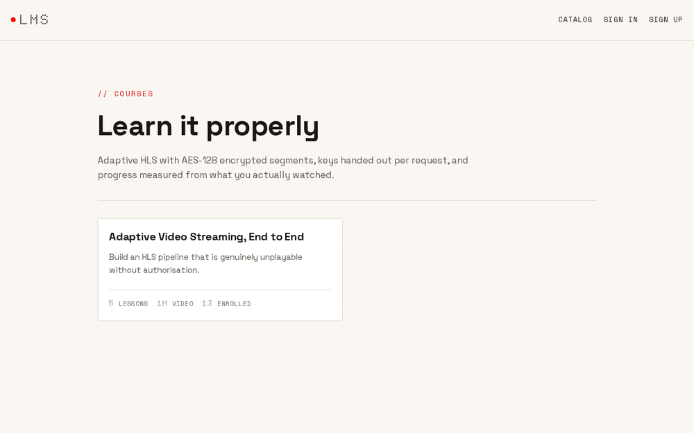

# LMS — adaptive video streaming with access control that actually holds

[](https://github.com/bastian-red/project003--lms/actions/workflows/ci.yml)

An online learning platform: courses, HLS video lessons, quizzes, PDF certificates
and an instructor dashboard.

The interesting part is not the CRUD. It is that **the video is genuinely
unplayable by anyone who is not currently enrolled**, and that **progress cannot
be faked by dragging the scrubber**. Both are mechanisms, not settings, and each
one has a test that fails if you remove it.



---

## The five properties, and the test that proves each

| # | Property | Where it lives | What proves it |
|---|---|---|---|
| 1 | Every segment on disk is AES-128 encrypted | `services/media/src/transcode.ts` | reads byte 0 of a real `.ts` and asserts it is **not** `0x47`, then decrypts it with the served key and gets a decodable stream |
| 2 | Authorization is live, not a one-time gate | `apps/api/src/media/media-access.service.ts` | revokes an enrollment mid-playback; the very next key fetch is 403 with the ticket still valid |
| 3 | Progress cannot be faked by seeking | `packages/shared/src/progress/intervals.ts` | seeks to `duration - 2`, reports it, and the lesson credits ~2 seconds and stays incomplete |
| 4 | Answer keys never leave the server | `packages/shared/src/quiz/grading.ts` | deep-scans the DTO and the rendered HTML for `isCorrect` / `acceptedAnswers` |
| 5 | A certificate means the course was finished | `apps/api/src/certificates/certificates.service.ts` | 409 with the outstanding lessons named; ten concurrent requests produce exactly one serial |

---

## How the video pipeline works

```
upload ──▶ VideoAsset + TranscodeJob        one transaction, so an asset that
           (apps/api/src/instructor)        nothing will process is unreachable
             │
             ▼
        apps/worker  ── SELECT … FOR UPDATE SKIP LOCKED
             │
             ▼
      services/media ── ffmpeg × 3 rungs, AES-128 via -hls_key_info_file
             │              key written to a private temp dir, removed in finally
             ▼
   var/media/assets/<id>/{360p,540p,720p}/seg*.ts   ← ciphertext, and nothing else
```

**The ladder.** Rungs above the source height are skipped, because upscaling
spends CPU and bandwidth to deliver a blurrier picture than the source.

| Rung | Resolution | Video | Audio |
|---|---|---|---|
| 360p | 640×360 | 800 kbps | 96 kbps AAC |
| 540p | 960×540 | 1400 kbps | 128 kbps AAC |
| 720p | 1280×720 | 2800 kbps | 128 kbps AAC |

Keyframes are forced onto segment boundaries and the GOP length is derived from
the probed frame rate, so boundaries line up across rungs. Without that, a
player switching rendition mid-stream stutters or skips.

**Encryption.** A 16-byte key and IV per asset. The key is handed to ffmpeg
through a key-info file in a private temp directory, deleted in a `finally`, and
persisted on the asset row. The URI written into the playlist is a placeholder
that the API rewrites per request, so the media directory holds nothing that can
decrypt itself. `assertEncrypted` reads a produced segment and refuses to report
success if it looks like a transport stream — a silent fallback to plaintext
would otherwise ship an unprotected course looking exactly like a protected one.

**Verification the transcode was complete.** ffmpeg exits 0 on a source it could
only partially read, so the sum of the `#EXTINF` values is cross-checked against
the probed duration. A truncated transcode is caught rather than stored.

### Playback, and why there are four routes

Nothing under `MEDIA_ROOT` is statically served.

| Route | Auth | Why |
|---|---|---|
| `GET /lessons/:id/manifest.m3u8` | service token | full enrollment check; mints the ticket |
| `GET /lessons/:id/rendition/:rung/:file` | ticket | rewrites segment + key URIs |
| `GET /lessons/:id/segment/:rung/:file` | ticket | ciphertext, useless without the key |
| `GET /lessons/:id/key` | ticket **+ live enrollment re-read** | where revocation bites |

The credential travels in the URL because `hls.js` and Safari's native player
issue their own requests for playlists, segments and the key, and there is no
portable way to attach an `Authorization` header to all of them. So the ticket
is designed to be safe there: HMAC-SHA256 over `{sub, lid, exp}`, compared with
`timingSafeEqual`, bound to one user **and** one lesson, and worth nothing on
its own — it only ever opens encrypted bytes.

The key endpoint is the one that re-reads the database. That is the whole
difference between "access was checked once" and "access is checked": revoking a
student stops their playback within one segment, while the ticket in their
browser is still minutes from expiry.

### Why the queue is Postgres and not Redis

`SELECT … FOR UPDATE SKIP LOCKED`. The job row and the asset row it describes
move in one transaction, so "asset exists, nothing will ever process it" is not
a reachable state. With an external broker, a crash between the two produces
exactly that and nothing in the system knows. A lease (`lockedAt` +
`JOB_LEASE_SECONDS`) makes `kill -9` on a worker recoverable rather than
permanent.

### Why progress is interval coverage

A lesson completes at 90% of **distinct seconds covered**, computed from merged
half-open intervals. Three defences, all in `packages/shared`:

1. every reported interval is clamped into `[0, duration]`;
2. new coverage per beat is capped at the wall-clock elapsed since that
   student's previous beat, so "POST one interval of `[0, 600]`" buys nothing;
3. coverage is a union, so replaying a range adds zero.

A Postgres trigger refuses any row claiming more watched seconds than the media
has — the last line of defence, and a violation there means the engine has a bug.

---

## Run it

```bash
git clone https://github.com/bastian-red/project003--lms.git
cd project003--lms

docker compose -f infra/docker-compose.yml up -d      # postgres 5435, redis 6382, mailhog 1028
cp .env.example .env
openssl rand -base64 32                                # paste into AUTH_SECRET

pnpm install
pnpm db:generate && pnpm db:migrate
pnpm db:seed        # generates demo video with ffmpeg, then transcodes it for real
pnpm dev            # web :3000, api :4000, worker
```

**ffmpeg is required.** `sudo apt install ffmpeg` / `brew install ffmpeg`, or
point `FFMPEG_PATH` and `FFPROBE_PATH` at an existing build. The seed synthesises
its own source clips with `testsrc2` and `sine`, so no video file is ever
committed to the repo.

Sign in as:

| Account | Role |
|---|---|
| `ada@lms.local` | student, enrolled |
| `grace@lms.local` | instructor |
| `admin@lms.local` | admin |

Password for all three: `course-demo-password`.

### Health

`GET /health` checks Postgres, Redis, that ffmpeg resolves and runs, that the
media directory is writable, and that a worker has checked in recently. Any
failure returns 503. The last three matter: a stack with no ffmpeg or no worker
accepts uploads and silently never produces a lesson.

---

## Tests

```bash
pnpm lint && pnpm typecheck && pnpm test    # gate: 218 unit tests, no DB, no network, <5s
./scripts/integration.sh                    # 43 tests against real Postgres + Redis + ffmpeg
./scripts/e2e.sh                            # 24 Playwright tests × chromium + firefox
```

The integration lane seeds as part of the run, which means it transcodes real
video with real ffmpeg every time. That is deliberate: the media fixtures the
tests read are produced by the same code path an instructor's upload takes.

### See it for yourself

```bash
# 1. anonymous manifest fetch → 401
curl -si localhost:4000/lessons/$LESSON/manifest.m3u8 | head -1

# 2. a segment on disk is not a transport stream (first byte is not 0x47)
od -A d -t x1 -N 4 var/media/assets/$ASSET/720p/seg00000.ts

# 3. ffmpeg cannot decode it without the key
ffmpeg -i var/media/assets/$ASSET/720p/seg00000.ts -f null -   # Invalid data found
```

---

## Architecture

```
project003--lms/
├── apps/web/                 Next.js 14 App Router — student, instructor, admin
├── apps/api/                 NestJS — every DB write, all media authorization
├── apps/worker/              transcode worker (SKIP LOCKED poller)
├── services/media/           ffmpeg ladder, HLS packaging, AES key custody, storage
├── services/certificates/    pdfkit rendering + serial generation
├── services/notifications/   nodemailer → Mailhog locally
├── packages/shared/          zod contracts + the pure engines
├── packages/db/              Prisma schema, migrations, seed
├── e2e/                      Playwright
└── infra/                    docker-compose + 3 Dockerfiles
```

**Stack:** Next.js 14, NestJS 10, PostgreSQL 16 + Prisma, Redis (rate limiting
only), ffmpeg, hls.js, Recharts, pdfkit, Auth.js v5.

**Auth.** The web app owns the Auth.js session; the API holds no session state.
The web server mints a five-minute HS256 service token from the shared
`AUTH_SECRET`, and that is the only thing that crosses between them — so the API
has no session store, no cookie parsing and no CSRF surface.

**Backend is CommonJS.** NestJS resolves constructor dependencies from the type
metadata `emitDecoratorMetadata` writes at compile time, and an `import type`
erases the class the metadata needs. `consistent-type-imports` is therefore off
for `apps/api`; its autofix produces code that compiles cleanly and dies at boot.

### Database invariants

Declared in `packages/db/prisma/migrations/*_lms_invariants`, because the
application is supposed to make them unreachable and a violation means there is
a bug to fix rather than a case to swallow:

- one non-terminal `TranscodeJob` per asset (partial unique index);
- a `READY` asset must have an output directory, a key, an IV and a duration;
- key and IV are exactly 16 bytes;
- `LessonProgress.secondsWatched` never exceeds the media duration (trigger);
- quiz scores stay within 0–100.

---

## Ports

Chosen so this stack coexists with the other projects in the portfolio.

| Service | Port |
|---|---|
| Postgres | 5435 |
| Redis | 6382 |
| Mailhog | 1028 (SMTP), 8028 (UI) |
| API | 4000 |
| Web | 3000 |

---

## Not deployed

This repository is published to GitHub and hosted nowhere. `docker compose up`
plus `pnpm dev` gives a working stack in one command, CI builds all three images
on every push, and the health check is exercised by the test suite. A repo that
clones and runs is the signal; a URL was never the point.
